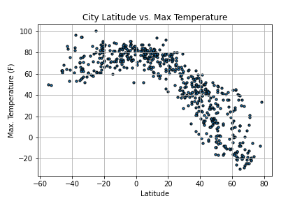
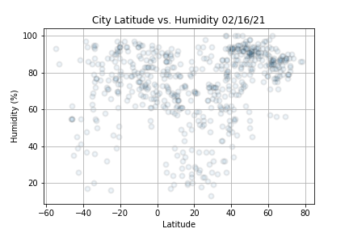

# World-Weather-Analysis
Using Python and APIs to give customers a tailored choice in choosing their city destination vacation.

###### Written by: David Adams
###### Written on: February 16, 2021
###### Written with: Python3, Jupyter-Notebook, PyCharm

## Basic Project Plan
* _Task_ : collect and analyze weather data across cities worldwide
* _Purpose_ : PlanMyTrip will use the data to recommend ideal hotels based on clients' weather preferences.
* _Method_ : Create a Pandas DataFrame with 500 or more of the world's unique cities and their weather data in real time. This process will entail collecting, analyzing, and visualizing the data.

## In-Depth Project Plan
1. Collect the data by:
    * Using the NumPy Module to generate more than 1,500 random latitudes and longitudes.
    * Use the citipy module to list the nearest city to the latitudes and longitudes
    * Use the OpenWeatherMap API to request the current weather data from each unique city in your list.
    * Parse the JSON data from the API request.
    * Collect the following data from the JSON file and add it to a DataFrame:
      * _City_, _County_, _Date_
      * _Latitude and longitude_
      * _Maxium temperature_
      * _Humidity_
      * _Cloudiness_
      * _Windspeed_
      
2. Exploratory Analysis with Visualization
    * Create scatter plots of the weather data for the following comparisons
      * Latitude versus Temperature
      * 
      * Latitude versus Humidity
      * 
      * Latitude versus Cloudiness
      * 
      * Latitude versus Wind Speed
      * 
    
    * Determine the correlations for the following weather data:
      * Latitude and Temperature - "The correlation between the latitude and the maximum temperature is strong to very strong because the r-value is less than –0.7 for the Northern Hemisphere and greater than 0.7 for the Southern Hemisphere, as shown by the plots here. This means that as we approach the equator, 0° latitude, the temperatures become warmer. And when we are further from the equator the temperatures become cooler. Check the r-values for your plots."
      * Latitude and Humidity - "The correlation between the latitude and percent humidity is very low because the r-value is less than 0.04 for the Northern and Southern Hemispheres for the plots shown here. This means that percent humidity is unpredictable due to changing weather patterns that can increase or decrease percent humidity. Check the r-values for your plots."
      * Latitude and Cloudiness - "The correlation between the latitude and percent cloudiness is very low because the r-value is less than –0.09 for the Northern Hemisphere and less than –0.02 for the Southern Hemisphere for the plots shown here. This means that cloudiness is unpredictable due to changing weather patterns that can increase or decrease percent cloudiness. Check the r-values for your plots."
      * Latitude and Wind Speed - "The correlation between the latitude and wind speed is very low because the r-value is less  than –0.07 for the Northern Hemisphere and less than –0.3 for the Southern Hemisphere for the plots shown here. This means that wind speed is unpredictable due to changing weather patterns that can increase or decrease wind speed. Check the r-values for your plots."
      
    * Create a series of heatmaps using the Google Maps and Places API that showcase the following:
      * Latitude and Temperature
      * 
      * Latitude and Humidity
      * 
      * Latitude and Cloudiness
      * 
      * Latitude and Wind Speed
      * 
      
3. Visualize Travel Data
    * Create a heatmap with pop-up markers that can display information on specific cities based on a customer's travel preferences. 
    * 
